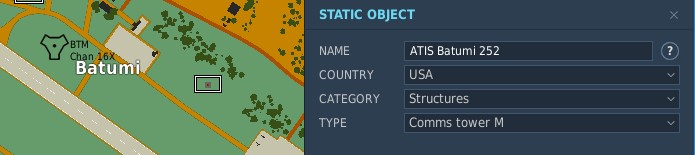
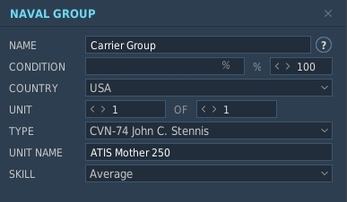

# DATIS

DCS World Automatic Terminal Information Service (ATIS) broadcasted through [Simple Radio Standalone](https://github.com/ciribob/DCS-SimpleRadioStandalone). Automatically starts within DCS, extracts weather information from the currently running mission, generates various report, converts it to speech and broadcasts it through SRS.

[Changelog](./CHANGELOG.md) | [Prebuild Releases](https://github.com/rkusa/DATIS/releases)

Example Report:

> This is Batumi information Alpha. Runway in use is 13. Wind 140 at 9 knots. Visibility 0.5. Cloud conditions overcast 5, rain. Temperature 20.9 celcius. ALTIMETER 2933. REMARKS. 993 hectopascal. QFE 2930 or 992. End information Alpha.

Example Carrier Report:

> 99, Mother's wind 140 at 9 knots, altimeter 2933, CASE 1, BRC 276, expected final heading 267, report initial

## Features

ATIS stations are not the only report kind this mod supports, all supported report kinds are:

- **ATIS stations**: Automatic Terminal Information Service broadcasts.
- **Carrier reports**: Report information relevant to carrier recoveries.
- **Broadcast of custom message**: Convert a custom message to speech and broadcast it through SRS.
- **Weather stations**: Similar report to ATIS stations, but not connected to an airfield. Can be used to report weather conditions at various parts of the map, like shooting ranges.

The mods uses the Window' built-in TTS by default, but can also either use Google Cloud's TTS, AWS Polly, or a combination of all of them (tip: setup both Google Cloud and Amazon Web Services to have a greater choice of different voices).

## Installation

~~_Before you start, be aware that this mod requires either a Google Cloud (Gcloud) or Amazon Web Services (AWS) account._~~
_Since version 1.0.0-alpha.2 it is possible to use Windows' built-in TTS engine, so a cloud account is not necessary anymore (but still useful for a wider range of voice choices)._

[Build it](#build) yourself and use the content inside the `mod` directory or use the pre-build mod from one of the [releases](https://github.com/rkusa/DATIS/releases).

1. Copy the content (`Mods` and `Scripts` directory) into `Saved Games\DCS.openbeta\`.
2. Optional (not necessary when using Window' built-in TTS): Setup your cloud provider of choice
   1. Create your cloud credentials, either
      1. Google Cloud: Go to https://console.cloud.google.com/apis/credentials and create an API key and restrict API access to Google Text-to-Speech, or
      2. Amazon Web Services: Go to https://console.aws.amazon.com/iam/home#/users and create a new user with `AmazonPollyReadOnlyAccess` permissions
   2. Open DCS go to OPTIONS -> SPECIAL -> DCS ATIS, enter your API keys into the respective input fields

Once you start a mission that contains a pattern as described in the next section, DATIS runs automatically.
It thereby expects a SRS server to run locally on the default SRS ports. The port can be changed in the DCS DATIS mod settings page.

If DATIS isn't working, you might find some helpful information in the log file at `DCS.openbeta\Logs\DATIS.log`.

For information about the free tier of both GCloud and AWS see:
- https://cloud.google.com/text-to-speech/pricing
- https://aws.amazon.com/polly/pricing/

## Setup

### Setup ATIS stations

There are two methods for adding ATIS stations to your mission. The first method is easier to setup, but the second one supports more configuration options.

#### Mission Situation

Add the following text pattern as often to the mission situation as you like.

```
ATIS {Airfield} {ATIS Frequency}
```

Examples:

```
ATIS Kutaisi 251.000
ATIS Batumi 131.5
ATIS Senaki-Kolkhi 145
```

This method uses the default voice, which can be changed in the mod options.

#### Using Static Units

Add a static unit per ATIS station to the mission, e.g. a communication tower (the kind of static unit doesn't matter though). The key to get ATIS working, is to name the static unit using the following pattern:

(`{}` denotes a part that has to be replaced with a proper value and `[]` denotes an optional part)

```
ATIS {Airfield} {ATIS Frequency}[, TRAFFIC {TRAFFIC Frequency}][, VOICE {VOICE NAME}]
```

Your choice for `{VOICE NAME}` depicts which cloud provider is used for a particular ATIS station.
For Window's built-in TTS prefix it with `WIN:`, for GCloud with `GC:` and for AWS with `AWS:`.

Available voices are:

- Windows: `WIN` or `WIN:voice` (Where voice depends on the installed voices on your system. Tip: if you don't know which voices are installed, set anything, start your mission and look into the DATIS looks to see a list of available voices)
- GCloud: `en-US-Standard-B`, `en-US-Standard-C`, `en-US-Standard-D`, `en-US-Standard-E`, `en-US-Wavenet-A`, `en-US-Wavenet-B`, `en-US-Wavenet-C`, `en-US-Wavenet-D`, `en-US-Wavenet-E`, `en-US-Wavenet-F`
  - _(a bit down [on this page](https://cloud.google.com/text-to-speech/) is a widget where the different voices can easily be tested)_
  - Keep in mind that `en-US-Wavenet-*` voices come with a smaller free quota (see [Gcloud TTS pricing](https://cloud.google.com/text-to-speech/pricing))
- AWS: `Nicole`, `Russell`, `Amy`, `Emma`, `Brian`, `Aditi`, `Raveena`, `Ivy`, `Joanna`, `Kendra`, `Kimberly`, `Salli`, `Joey`, `Justin`, `Matthew`, `Geraint`

The default can be changed in the DCS SPECIAL settings for DATIS.

Examples:

```
ATIS Batumi 131.5
ATIS Kutaisi 251.000, TRAFFIC 252.000
ATIS Kutaisi 251.000, VOICE en-US-Standard-E
ATIS Kutaisi 251.000, TRAFFIC 252.000, VOICE en-US-Standard-E
ATIS Kutaisi 251.000, TRAFFIC 252.000, VOICE GC:en-US-Wavenet-B
ATIS Kutaisi 251.000, TRAFFIC 252.000, VOICE AWS:Nicole
ATIS Kutaisi 251.000, TRAFFIC 252.000, VOICE WIN
```



### Setup Carrier Reports

Name your carrier unit (unit not group!) using the following pattern:

(`{}` denotes a part that has to be replaced with a proper value and `[]` denotes an optional part)

```
CARRIER {Name} {Frequency}[, VOICE {VOICE NAME}]
```



### Setup Broadcast of Custom Messages

Place a unit (doesn't matter if it is a static unit, a plane, a vehicle, ...) and name it (the unit not the group!) using the following pattern:

(`{}` denotes a part that has to be replaced with a proper value and `[]` denotes an optional part)

```
BROADCAST {Frequency}[, VOICE {VOICE NAME}]: {Message}
```

Example:

```
BROADCAST 251.000, VOICE AWS:Brian: Help help!
```

### Setup Broadcast of Weather Stations

Place a unit (doesn't matter if it is a static unit, a plane, a vehicle, ...) and name it (the unit not the group!) using the following pattern:

(`{}` denotes a part that has to be replaced with a proper value and `[]` denotes an optional part)

```
WEATHER {Station Name} {Frequency}[, VOICE {VOICE NAME}]
```

Example:

```
WEATHER Mountain Range 251.000, VOICE en-US-Standard-E
```

### Development

## Crates

- [**datis-cmd**](./crates/datis-cmd) - A utility to start DATIS from the command line. Mostly intended for testing-purposes.
- [**datis-core**](./crates/datis-core) - The core functionality: generating the report and talking to SRS.
- [**datis-module**](./crates/datis-module) - A Lua module that can be integrated into DCS to automatically start ATIS stations.
- [**radio-station**](./crates/datis-station) - A command line utility to play OGG/OPUS audio files through a specified SRS frequency.
- [**srs**](./crates/srs) - A re-usable Rust SRS client that is used for all the other crates.
- [**win-media**](./crates/win-media) - Bindings to a subset of the Windows Runtime (separate crate to reduce the compile time during development).
- [**win-tts**](./crates/win-tts) - A library to convert text to speech using the Window Runtime.
-
## Build

Instead of building you can also use the pre-build mod from one of the [releases](https://github.com/rkusa/DATIS/releases).
Otherwise, build with [Rust (stable)](https://rustup.rs/):

```
make release
```

## License

[MIT](./LICENSE.md)
