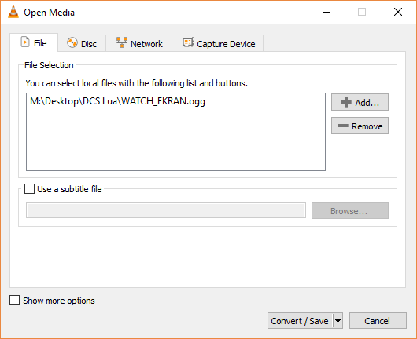
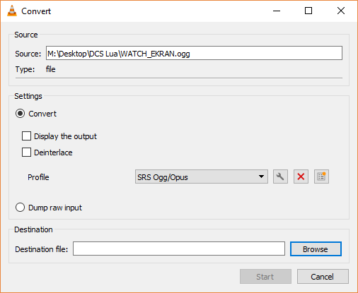
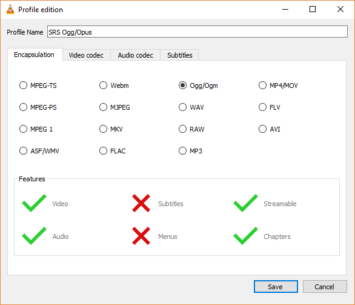
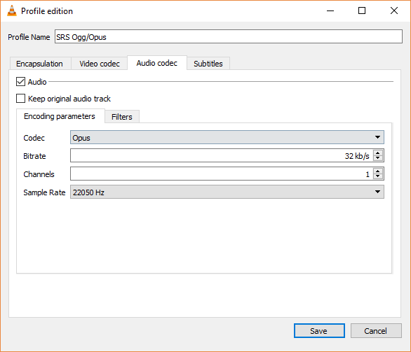

# Convert Audio Files to OGG/OPUS with VLC

1. Open VLC
2. Go to _Media_ -> _Convert/Save_
3. Add the files you want to convert to the _File Selection_
    
    

4. Click the _Convert/Save_ button

    
    
5. Select the _Convert_ radio button and hit the _Create a new profile_ icon (the third icon) next to the _Profile_ select
6. Name the Profile, and select _Ogg/Ogm_ under the _Encapsulation_ tab    

    
    
7. Under the _Audio codec_ tab

    - check the _Audio_ checkbox
    - select _Opus_ as the _Codec_
    - set a _Bitrate_ of _32 kb/s_ (this is important, no other value will work)
    - set _Channels_ to 1
    - set _Smaple Rate_ to _22050 Hz_   
    
    

8. Save the profile
9. Back on the _Convert_ dialog, select the destination file and hit the _Start_ button

